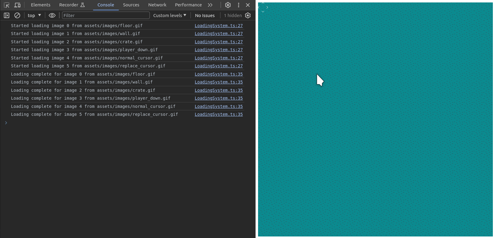
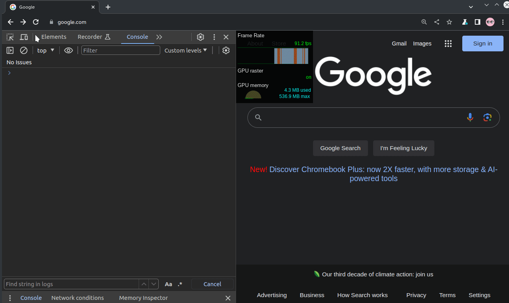

# Zomboban!

"Do Zombies exist? No, but if they ever do, we'll be ready!" proclaimed the founder of _Zomboban LLC_, a Mill Valley-based biotech startup, after closing a thirteen-million dollar funding round. This is despite the cloud of uncertainty surrounding recent events at one of their facilities in San Rafael. Reports of missing persons, property damage and suspicious behavior seem to be concentrated around the facility. A spokesperson for Zomboban said that the company is investigating.

You turn off the radio, cursing under your breath. I'm a scientist, not a private eye, dammit. But those stock options, though...

"Your destination is on the left" chirps the GPS.

[To be continued]

# Development

Still very much a WIP.

`yarn && yarn start` should do it. Had issues with Parcel hanging after a bit on my system so I have it automatically stopping after a certain amount of time.

# Screenshots

Week 1: Using the editor then toggling into play mode.

Week 2: Loading level data (basic), zombie movement (using player's image for now), pushing crates, reset level

Week 6: Throw dezombifying potion, Undo, Zombies stop your progress, Lots of art development.

