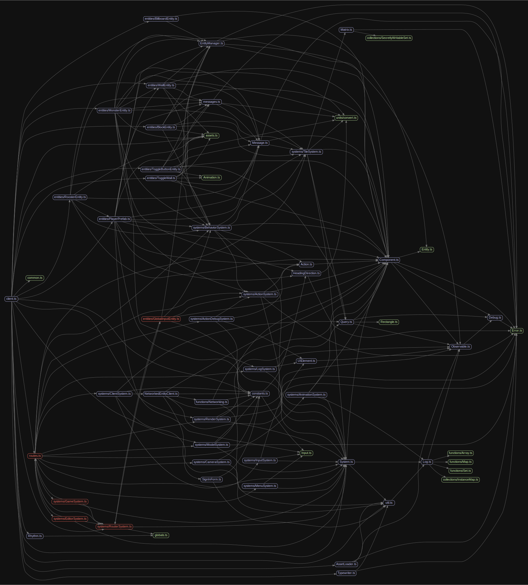
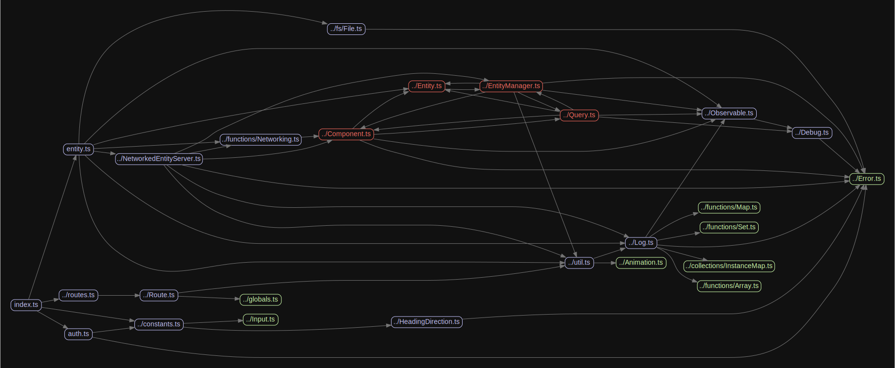

# Zomboban!

Working title.

https://github.com/patreeceeo/zomboban/assets/578371/ce4c1869-71dd-4dc6-b1fe-b81b7b9f082f

# Development

1. Install dependencies with `yarn`.
1. Run dev server with `yarn dev`.

## client dependency graph

## server dependency graph

